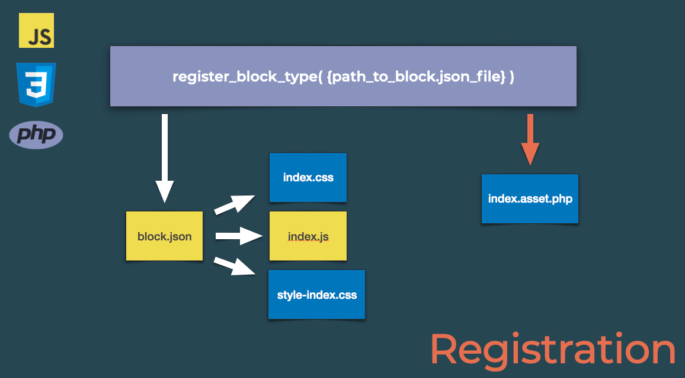

# Start Here!

** Welcome to Hello Blocks! Coding a custom block SLS session! **

I have created this Repl to allow everyone to code long without having to worry about installing or configuring anything. You only need to press the Run button at the top of the page and you'll have a working WordPress site and all of the command line tools you'll need to follow along with me!

Due to some limitations of the Replit plaform, you will need to open the site in a separate tab to be able to login and access the WordPress admin. Look for the box with the arrow in the top right of the frame to pop out the page.

## Steps to get started
1. Press the Run button at the top of the page
2. Be sure to popout the browser window using the box with the arrow in the top right of the panel.
3. Add `/wp-login.php` to the end of your site URL to access the login page
4. Log in using the following credentails:
	* Username: admin
	* Password: password

# Block Overview

## What is a block?

[developer.wordpress.org](https://developer.wordpress.org/block-editor/explanations/glossary/#block) defines a block as:

>**The abstract term to describe units of markup that composed together form the content or layout of a web page**.

Well, what does that mean?

A Block is a self-contained, fully-functional item. It has a single purpose, to manage and output its markup and is typically not dependent on other blocks - although some blocks are better when used with others such as the Columns or Group block. 

You can think of an individual block as a puzzle piece and the web page is the rest of the puzzle and every little block fits together to create a picture.

Another comparison is to the Lego building system. When you are are building a Lego house, you choose a series of blocks and put them together them to create the structure and aesthetic of your house. Each Lego piece serves it's purpose, is self-contained, and doesn't care about what the other pieces are doing. If you have a window block, it's job is to open and close and it doesn't care if you have 1 or 10 windows or even if it is on the roof.

From a development standpoint, blocks consist of both JavaScript and PHP code. PHP is used to register the block while JavaScript provides the interface in the Block editor. There are some nuances here when it comes to the type of block being created. Which leads me to my next topic, block types.

## Types of Blocks

Blocks fall into two types: static and dynamic. The difference between the types comes down to how they are saved into the database and the process by which they are rendered on the page. 

When saved, all blocks are wrapped in HTML comments. The HTML comments are used determine the placement of the block in the content and to store block attributes. These comments are stripped out by WordPress before being rendered. 

Where the difference between how static and dynamic blocks are saved becomes apparent, is how the markup is saved. Static blocks save their markup to the database while dynamic blocks do not.

For example, here is a how a static Paragraph block looks when saved in the database:

```html
<!-- wp:paragraph {"textColor":"dark-gray","fontSize":"medium"} -->
<p class="has-dark-gray-color has-text-color has-medium-font-size">This is an example paragraph</p>
<!-- /wp:paragraph -->
```
And this is how a dynamic Tag Cloud block looks:

```html
<!-- wp:tag-cloud {"numberOfTags":68,"showTagCounts":true} /-->
```

The next difference is how the blocks are rendered, static blocks take the markup saved in the database and display it on the webpage while a dynamic blocks markup is rendered by PHP on the fly using a special function defined as part of the blocks registration process.

### Things to consider when choosing a block type

#### Static Blocks
* If a plugin that provides a static block is deactivated or uninstalled, the block markup will remain because it is saved as part of the post content.
* If there is a change to the markup your block generates, you must add a [Deprecation](https://developer.wordpress.org/block-editor/reference-guides/block-api/block-deprecation/) to your block defintion in order for Gutenberg to understand and manage the change to existing block instances. Additionally, any blocks that exist in your site content must be manually updated.

#### Dynamic Blocks
* If a plugin that provides a dynamic block is deactivated or uninstalled, the block will not render on the front end of the site as the code required to dynamically render the block will no longer be run.
* Any changes to your dynamic block markup will be automatically updated for all instance of the block and without the need to add a Deprecation.
* You may need to maintain markup in two places, the edit compoent and the render callback.


# File Structure

As mentioned in the [block begistration](https://replit.com/@learnwp/Hello-Blocks#.lesson/block-registration.md) section, blocks must be registered from a plugin. This repl contains 3 custom plugins in the `wp-content/plugins` directory:

1. `my-first-block`
2. `my-first-dynamic-block`
3. `my-first-es5-block`

All of these blocks were built using the [create-block](https://developer.wordpress.org/block-editor/reference-guides/packages/packages-create-block/) package to quickly scaffold out new blocks.

# Plugins with a build process
With the exception of `my-first-es5-block`, each of the plugins contain the following:

1. A PHP file in the directory root as per [WordPress plugins best practices](https://developer.wordpress.org/plugins/plugin-basics/best-practices/#file-organization) where `register_block_type` is called.
2. A `src` directory containing the all of the raw files that will be compiled together into the `build` directory.
3. A `build` directory containing the compiled files that will be enqueued during the registration process.
4. A `package.json` file containing all of the scripts and dependencies needed for the project.
5. A `node_modules` directory. This is used to store all of the downloaded dependencies for the project.
6. `.editorconfig`, `.eslintrc` - these files are used to configure how the project files should be formatted.

## `my-first-es5-block`
The `my-first-es5-block` plugin is a special use-case where there is no build process. As such the files that would normally be contained in the `src` and complied into the `build` directories are stored in the root directory. It also doesn't have a `package.json` file or corresponding `node_modules` folder.

## src directory
1. block.json - This is the configuration file for the block. There is a lot in this file so [please read the docs here](https://developer.wordpress.org/block-editor/reference-guides/block-api/)
2. index.js - the file that contains the call to [`registerBlockType`](https://developer.wordpress.org/block-editor/reference-guides/block-api/block-metadata/#javascript-client-side) which registers the block on the client-side .
3. save.js - This file contains the [`save` function](https://developer.wordpress.org/block-editor/reference-guides/block-api/block-edit-save/#save) which handles how the content is saved in a static block or returns null in a dynamic block.
4. edit.js - This file contains the [`Edit` component](https://developer.wordpress.org/block-editor/reference-guides/block-api/block-edit-save/#edit) that is used it display the blocks UI in the Block Editor.
5. editor.scss - Sass file containing styles intended for the block editor only
6. style.scss - Sass file containing styles intended for both the front end of the site and the block editor.

# Block Registration

Prior to WordPress 5.8, registering a custom block was a very manual process that required manually enqueueing the required JavaScript and CSS files as well as calling `register_block_type`. With the introduction of the `block.json` file, the majorty of these steps have been abstracted away resulting in a much more streamlined process.

Registering a block boils down to two teps:

1. Configuring your blocks `block.json` file
2. Calling `register_block_type` from your plugin passing the path to the `block.json` file




Some things to note:

1. Blocks must be registered from a plugin. Themes cannot register blocks.
2. An `index.assets.php` file MUST exist in the same location as block.json.

# The build process.

The build process for  blocks is provided by the [@wordpress/scripts package](https://developer.wordpress.org/block-editor/reference-guides/packages/packages-scripts/). It is webpack based an can be easily extended as needed to integrate with existing projects.

Webpack is notoriously difficult to set up and configure so this package has been designed to be as transparent as possible and "just work".

At a high level, the build takes the files in the `src` directory and transpiles them into thier `build` counterparts. Along the way it generates the `index.asset.php` file and copies the existing `block.json` file into that directory as well.


## Do you need a build process?
No! You don't need to use the build process at all. In fact, have a look at the ``my-first-es5-block`` example to see how you can still create custom block using vanilla JavaScript without a build process.


## Should you use the build process?
Yes! Using the build process provided by the `@wordpress/scripts` package will allow you to use more advanced JavaScript features take advantage of using JSX syntax, automate your dependencies and fully leverage the Block Registration API.

### JSX

A major reason to use the build process is to be able to leverage [JSX syntax](https://reactjs.org/docs/introducing-jsx.html). This is a syntax extension for JavaScript that is commonly used with React.js - the framework that Gutenberg is built on. Using JSX can make your code more readable as it is very similar in syntax to HTML.

## Comparing JSX to Vanilla JavaScript

### JSX

```javascript
return (
		<p { ...useBlockProps() }>
			{ __(
				'My First Block – hello from the editor!',
				'my-first-block'
			) }
		</p>
	);
```

### Vanilla JS
```js
return el(
	'p',
	useBlockProps(),
	__( 'My First ES5 Block – hello from the editor!, 'my-first-es5-block' )
);
```
### Import syntax
By leveraging the build process, we can take advantage of [JavaScript modules](https://developer.mozilla.org/en-US/docs/Web/JavaScript/Guide/Modules) to import and export files and components. This allows us to better organize and reuse our code.

### Dependency Managagment
When JavaScript files are enqueued, an array of dependences can be passed that need to be loaded before the script. Historically, this was a manual process to update. The build process contains a special Webpack plugin called [@wordpress/dependency-extraction-webpack-plugin](https://developer.wordpress.org/block-editor/reference-guides/packages/packages-dependency-extraction-webpack-plugin/). This file is responsible for generating the `index.assets.php` file that is in the `build` directory and part of that process is updating the the dependencies for any `@wordpress/*` packages that have been used.

### Static Code Analysis.
The build process also provides many command to check our code is formatting correctly and automate fixing any issues that are found. 

### MOAR COMMANDS!
There are many other commands available to make our lives as developers easier:

```json
{
	"scripts": {
		"build": "wp-scripts build",
		"check-engines": "wp-scripts check-engines",
		"check-licenses": "wp-scripts check-licenses",
		"format": "wp-scripts format",
		"lint:css": "wp-scripts lint-style",
		"lint:js": "wp-scripts lint-js",
		"lint:md:docs": "wp-scripts lint-md-docs",
		"lint:md:js": "wp-scripts lint-md-js",
		"lint:pkg-json": "wp-scripts lint-pkg-json",
		"packages-update": "wp-scripts packages-update",
		"plugin-zip": "wp-scripts plugin-zip",
		"start": "wp-scripts start",
		"test:e2e": "wp-scripts test-e2e",
		"test:unit": "wp-scripts test-unit-js"
    }
}
```
[Home](https://replit.com/@learnwp/Hello-Blocks#.lesson/instructions.md) | [Next: Exercise - Adding a custom attribute and color controls to your block](https://replit.com/@learnwp/Hello-Blocks#.lesson/exercise.md)


# Exercise: Adding a custom attribute and color controls to your block.

In this exercise, we're going to update the `my-first-block` plugin to allow the user to input a custom message and set both a background and text color for the block.

We're going to go through this as far as we can during the session but don't feel rushed! You can finish this at your leisure and if you get stuck, right click on your code, click [start a thread](https://blog.replit.com/threads) and ask me a question!

## Start the build process
1. In the **Shell** tab, navigate to the `my-first-block` plugin by typing `cd wp-content/plugins/my-first-block/`
2. Start the build process by running `npm run start` or `npm start`. This will start the build process in "watch" mode with will detect any changes to the files and rebuild them as needed.

## Add a new attribute to block.json

1. In the **Files** tab, navigate to the `wp-content/plugins/my-first-block/src` directory
2. Open the `block.json` file
3. Add the `attributes` property
4. Add a new `message` attribute that is of type `string` and has the default value of `My Custom Message`. Use the [Attributes reference](https://developer.wordpress.org/block-editor/reference-guides/block-api/block-attributes/) if you get stuck!

## Update the Edit component to access and update the message
1. Update the Edit component to accept a `props` parameter.
2. [Using object destructuring](https://developer.mozilla.org/en-US/docs/Web/JavaScript/Reference/Operators/Destructuring_assignment#object_destructuring), create a new `const` called `attributes` from `props`
3. [Using object destructuring](https://developer.mozilla.org/en-US/docs/Web/JavaScript/Reference/Operators/Destructuring_assignment#object_destructuring), create a new `const` called `setAttributes` from `props`
4. [Using object destructuring](https://developer.mozilla.org/en-US/docs/Web/JavaScript/Reference/Operators/Destructuring_assignment#object_destructuring), create a new `const` called `message` from `attributes`
5. Import the `RichText` component from the `@wordpress/block-editor` package. *Hint: That package is already being used to import useBlockProps*
6. Using the [docs as reference](https://github.com/WordPress/gutenberg/blob/HEAD/packages/block-editor/src/components/rich-text/README.md), replace the existing `<p>` tag with a `<RichText />` instance making sure to add the `{...useBlockProps()}` and set the following props: `tagName`,`value`, `Onchange`.

## Update the save function to use RichText
1. Import the `RichText` component from the `@wordpress/block-editor` package. *Hint: That package is already being used to import useBlockProps*
2. Using the [docs as reference](https://github.com/WordPress/gutenberg/blob/HEAD/packages/block-editor/src/components/rich-text/README.md), replace the existing `<p>` tag with a `<RichText.Content />` instance making sure to add the `{...useBlockProps.save()}` and set the following props: `tagName` and `value`


## Add Text and Background controls to block.json
1. Add a new `color` property to the `supports` property of block.json
2. Using [the docs as reference](https://developer.wordpress.org/block-editor/reference-guides/block-api/block-supports/#color), allow the use of text and background colors for your block.

## Bonus
1. Add something new to your block! Go wild!